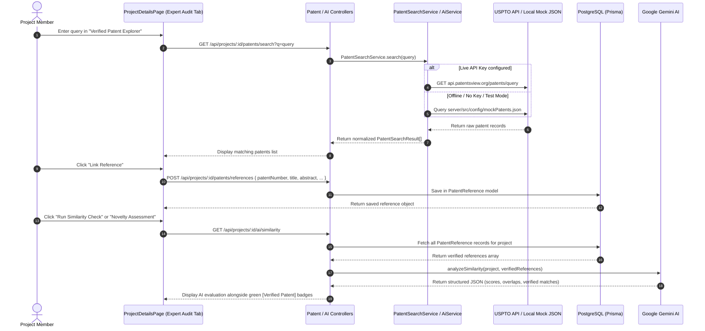
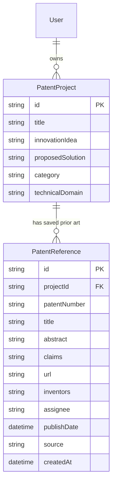

# TASK 4: Patent Search & Prior-Art Intelligence Pre-Implementation Audit

This document presents a comprehensive, pre-implementation audit for **TASK 4: Real Patent Search & Prior-Art Intelligence** in the **PatentHub-AI** platform.

---

## 1. Current Implementation Status

*   **Task 1 (Project-Scoped Roles & Policy Architecture):** Completed. Fully implemented fine-grained, project-scoped authorization policies (`ProjectPolicy`, `MembershipPolicy`, `DocumentPolicy`, `WorkflowPolicy`, `ReviewPolicy`, `PatentFormPolicy`). Decoupled global system roles (`User.role`) from project-scoped roles (`ProjectMember.role`).
*   **Task 2 (Hardened Membership & Invitation Lifecycle):** Completed. Implemented invitation token generation, multi-user role assignment constraints, project owner transfer rules, and transaction-wrapped membership state mutations in `collaborationController.ts` and `projectService.ts`.
*   **Task 3 (AI Diagnostics & Google Gemini Integration):** Completed. Integrated Google Gemini (`gemini-1.5-flash`) via `AiService.ts` with structured JSON schema outputs for draft generation, similarity diagnostics, novelty scoring, and schematic drawing component annotation. Hardened with 502 Bad Gateway fallback handling and strict validation.
*   **Current State of AI Workspace & Expert Audit:**
    *   **Frontend:** `ProjectDetailsPage.tsx` contains the **AI Workspace** tab (interactive specification drafting assistant) and the **Expert Audit** tab (patent search explorer, reference manager, similarity analysis card, and novelty assessment card).
    *   **Backend:** Endpoints mapped under `/api/projects/:id/patents/search`, `/api/projects/:id/patents/references`, `/api/projects/:id/ai/similarity`, and `/api/projects/:id/ai/novelty` handle public registry search, project reference management, and AI prior-art diagnostic checks.

---

## 2. Existing Patent Functionality

### 2.1 Database Models
*   **`Patent` (Legacy):** Defined in [schema.prisma](file:///d:/PatentHub-AI/server/prisma/schema.prisma#L183-L195). Tied to an individual `User` via `userId`. Represents user-uploaded draft documents, not prior-art references or project-level search results.
*   **`PatentReference` (Project-Scoped):** Defined in [schema.prisma](file:///d:/PatentHub-AI/server/prisma/schema.prisma#L216-L233). Tied directly to a `PatentProject` via `projectId` with a composite unique constraint `@@unique([projectId, patentNumber])`. Stores verified patent metadata (`patentNumber`, `title`, `abstract`, `claims`, `url`, `inventors`, `assignee`, `publishDate`, `source`).

### 2.2 Backend API Endpoints & Routes
Registered inside [projectRoutes.ts](file:///d:/PatentHub-AI/server/src/routes/projectRoutes.ts#L54-L64):
*   `GET /api/projects/:id/patents/search?q=query` $\rightarrow$ `patentController.searchPatents` (Protected by `PatentReferencePolicy.canSearch`)
*   `GET /api/projects/:id/patents/references` $\rightarrow$ `patentController.getSavedReferences` (Protected by `PatentReferencePolicy.canViewReferences`)
*   `POST /api/projects/:id/patents/references` $\rightarrow$ `patentController.saveReference` (Protected by `PatentReferencePolicy.canSaveReference`)
*   `DELETE /api/projects/:id/patents/references/:refId` $\rightarrow$ `patentController.deleteReference` (Protected by `PatentReferencePolicy.canDeleteReference`)
*   `GET /api/projects/:id/ai/similarity` $\rightarrow$ `aiController.getSimilarityAnalysis` (Protected by `ProjectPolicy.canViewProject`)
*   `GET /api/projects/:id/ai/novelty` $\rightarrow$ `aiController.getNoveltyAssessment` (Protected by `ProjectPolicy.canViewProject`)

### 2.3 Authorization Policies
*   Declared in [PatentReferencePolicy.ts](file:///d:/PatentHub-AI/server/src/policies/project/patent-reference.policy.ts). Evaluates project-scoped roles (`OWNER`, `ADMIN`, `EDITOR`, `VIEWER`).
*   Does **not** use global `user.role` for project access checks, maintaining compliance with Task 1 architecture.

### 2.4 Test Suite
*   39 integration/unit tests implemented in [policies.test.ts](file:///d:/PatentHub-AI/server/src/tests/policies.test.ts) covering authentication, project policies, document policies, review policies, workflow transitions, invitation lifecycle, AI controllers, and fallback behaviors.

---

## 3. TASK 3 Limitation & Evolution

### 3.1 Initial Limitation (Task 3 Baseline)
In the initial Task 3 implementation, Gemini similarity checks operated purely conceptually. Because no external patent dataset was connected:
*   `priorArtReferences` was returned as an empty array `[]` when no saved references existed.
*   The system returned a fallback message advising the user to search and link verified prior-art references before running diagnostics.

### 3.2 Current Verified Integration (Task 4 Target)
The AI similarity engine in `AiService.ts` operates on **saved, verified prior-art references**:
1.  When a user runs AI Similarity or Novelty analysis, `aiController.ts` queries all `PatentReference` records linked to the project from PostgreSQL via Prisma.
2.  `AiService.analyzeSimilarity` formats the verified references into a structured block and feeds them to Gemini.
3.  The system prompt explicitly commands Gemini:
    > *"Analyze the project relative ONLY to these verified prior art references. Do NOT invent, hallucinate, or reference any other patent numbers or titles."*
4.  Gemini returns similarity percentages and drawback overlaps **strictly mapped** to the provided patent numbers.
5.  If no references are linked to the project, the system returns a `0` similarity/novelty score with an explanatory message rather than inventing fake patents.

---

## 4. Patent Data Source Evaluation

We evaluated five primary public and commercial patent data sources:

| Patent Source | API Availability | Auth Requirements | Cost / Free Tier | Capabilities & Metadata | Claims & Classification | Rate Limits | Suitability for Student Project | Legal & Usage Considerations |
| :--- | :--- | :--- | :--- | :--- | :--- | :--- | :--- | :--- |
| **WIPO PATENTSCOPE** | Closed / Restricted | Subscriber Credentials | Paid Subscription | Global PCT applications, full text | IPC/CPC support | Strict subscriber limits | **Poor** (No public API access) | Closed dataset for commercial/subscriber use only. |
| **EPO Open Patent Services (OPS v3.2)** | High | OAuth 2.0 (Client Key & Secret) | Free tier up to 4 GB / week | Comprehensive global coverage, biblio data | Full claims & CPC classifications | 30 requests/min (free tier) | **Good** (Robust global metadata) | Requires registering developer app and token management. |
| **Google Patents** | No Official Search API | N/A | Free (BigQuery SQL) / Scraping | Public dataset via BigQuery | Full claims & CPC classifications | BigQuery query quotas | **Medium** (Scraping risks IP bans; BigQuery is complex) | Scraping Google Patents violates Terms of Service. |
| **Lens.org (The Lens)** | REST API | API Access Token | 14-Day Trial / Academic Request | High quality, scholarly + patent links | Claims & CPC classifications | Tier-dependent | **Medium** (Trial expires quickly) | Requires formal academic approval for extended non-commercial use. |
| **USPTO PatentsView / Open Data Portal** | REST API | `X-Api-Key` HTTP Header | Free Public Access | US Grants & Applications, biblio, abstract | Title, abstract, inventors, assignee, dates | Rate-limited per key | **High** (Standard US patent queries, key-based) | Open public government dataset. Free for developer use. |

---

## 5. Recommended Architecture & Source Selection

### 5.1 Recommended Source: USPTO PatentsView + Local Mock Fallback
We recommend a **Dual-Mode Patent Search Architecture**:
1.  **Online Mode (USPTO PatentsView API):** When `PATENTSVIEW_API_KEY` is present in `.env`, `PatentSearchService` dispatches queries to the USPTO PatentsView search endpoint via HTTP using an 8-second AbortController timeout.
2.  **Offline / Fallback Mode (Local Mock Registry):** When `PATENTSVIEW_API_KEY` is missing, unconfigured, or when running unit tests, `PatentSearchService` queries a local structured JSON database ([mockPatents.json](file:///d:/PatentHub-AI/server/src/config/mockPatents.json)) containing realistic patent records.

### 5.2 Rationale
*   **Zero-Dependency Testing:** Guarantees that the automated test suite (`npx ts-node src/tests/policies.test.ts`) passes 100% offline without network calls.
*   **Resilience:** Prevents developer setup blockers if external API endpoints undergo maintenance or experience rate limiting.
*   **Compliance:** Ensures zero risk of AI hallucination by separating verified metadata from AI diagnostic interpretation.

---

## 6. Proposed System Architecture



### 6.1 Strict Data Separation
*   **Verified Data:** Fields fetched directly from USPTO/Mock (`patentNumber`, `title`, `abstract`, `claims`, `url`, `inventors`, `assignee`, `publishDate`, `source`). Preserved in database without modification.
*   **AI Analysis:** Diagnostic ratings generated by Gemini (`similarityScore`, `riskLevel`, `matchingConcepts`, `overlappingFeatures`, `noveltyScore`, `strength`, `strongAreas`, `weakAreas`, `recommendations`, `disclaimer`).
*   **Anti-Hallucination Enforcer:** Gemini prompts explicitly forbid generating prior-art numbers not in the `verifiedReferences` list.

---

## 7. Database Audit & Schema Specification

### 7.1 Entity Relationship Diagram



### 7.2 Required Prisma Model Definition
The schema addition in [schema.prisma](file:///d:/PatentHub-AI/server/prisma/schema.prisma#L216-L233) is:

```prisma
model PatentReference {
  id             String        @id @default(uuid())
  projectId      String
  project        PatentProject @relation(fields: [projectId], references: [id], onDelete: Cascade)
  patentNumber   String
  title          String
  abstract       String?       @db.Text
  claims         String?       @db.Text
  url            String?
  inventors      String?
  assignee       String?
  publishDate    DateTime?
  source         String        @default("USPTO") // "USPTO", "MOCK"
  createdAt      DateTime      @default(now())
  updatedAt      DateTime      @updatedAt

  @@unique([projectId, patentNumber])
}
```

---

## 8. Authorization & Permission Matrix

Access permissions for Patent Search and Prior-Art Intelligence are governed strictly by project-scoped roles via `PatentReferencePolicy`:

| Operation | HTTP Method & Route | Minimum Role Required | Policy Method |
| :--- | :--- | :--- | :--- |
| **Search Patent Registries** | `GET /projects/:id/patents/search` | Any Project Member (`OWNER`, `ADMIN`, `EDITOR`, `VIEWER`) | `PatentReferencePolicy.canSearch` |
| **View Saved References** | `GET /projects/:id/patents/references` | Any Project Member (`OWNER`, `ADMIN`, `EDITOR`, `VIEWER`) | `PatentReferencePolicy.canViewReferences` |
| **Link / Save Reference** | `POST /projects/:id/patents/references` | Project Editor / Owner (`OWNER`, `ADMIN`, `INVENTOR`, `CO_INVENTOR`) | `PatentReferencePolicy.canSaveReference` |
| **Delete Saved Reference** | `DELETE /projects/:id/patents/references/:refId` | Project Editor / Owner (`OWNER`, `ADMIN`, `INVENTOR`, `CO_INVENTOR`) | `PatentReferencePolicy.canDeleteReference` |
| **Run AI Diagnostics** | `GET /projects/:id/ai/similarity`, `/novelty` | Any Project Member (`OWNER`, `ADMIN`, `EDITOR`, `VIEWER`) | `PatentReferencePolicy.canRunAiAnalysis` |

---

## 9. Frontend Integration Audit

In [ProjectDetailsPage.tsx](file:///d:/PatentHub-AI/client/src/pages/ProjectDetailsPage.tsx#L1710-L2000), under `activeTab === 'Expert Audit'`:

1.  **Registry Search Panel:** Keyword search input box with live spinner loading states and `handlePatentSearch` submit handler.
2.  **Search Results List:** Card list rendering returned patent numbers, titles, abstracts, inventors, and publication dates. Includes `Link Reference` button with duplicate prevention (`isSaved` state check).
3.  **Saved References Panel:** Container rendering linked project references with direct external links to Google Patents / USPTO and `Delete` action triggers for authorized editors.
4.  **AI Diagnostics Dashboard:**
    *   **Similarity Overview Card:** Radial score indicator, risk level badge (`Low Risk`, `Medium Risk`, `High Risk`), matching concepts pill tags, and feature overlap breakdown.
    *   **Novelty Assessment Card:** Strength meter (`High`, `Medium`, `Low`), strong novel areas, weak areas, and actionable recommendations.
5.  **Visual Distinction Rule:**
    *   **Verified Data:** Light-slate/emerald containers tagged with green `[Verified USPTO Patent]` or amber `[Mock / Offline Data]` badges.
    *   **AI Diagnostics:** Indigo gradient containers tagged with sparkle icons `[AI Evaluation]` and explicit legal disclaimers:
        > *"AI-assisted preliminary assessment. This is not a legal opinion or a definitive patentability determination."*

---

## 10. Comprehensive Testing Strategy

All tests operate with **zero external network dependencies** by leveraging local mock fallbacks and stubbed database states in `policies.test.ts`:

1.  **Registry Search (Mock Mode):** Verify keyword search filters `mockPatents.json` correctly by title, abstract, or patent number.
2.  **Empty Query Validation:** Verify searching with empty query returns `400 Bad Request`.
3.  **Project Isolation:** Verify project `P1` cannot access or delete saved references belonging to project `P2`.
4.  **Unauthorized Access Block:** Verify non-project members receive `403 Forbidden` on search, save, and delete endpoints.
5.  **Duplicate Reference Prevention:** Verify attempting to save the same `patentNumber` twice for the same project returns `400 Bad Request`.
6.  **Malformed Response / Timeout Handling:** Verify external API HTTP 500/502 errors or 8-second timeouts resolve gracefully to 502 Bad Gateway with standard error payloads.
7.  **Verified Metadata Integrity:** Verify saved `PatentReference` records maintain original title, abstract, and URL without AI modification.
8.  **AI Anti-Hallucination Verification:** Verify Gemini similarity output `matches` array only references patent numbers present in `verifiedReferences`.

---

## 11. Security Considerations

*   **API Key Protection:** `PATENTSVIEW_API_KEY` and `GEMINI_API_KEY` are stored strictly in server-side `.env` files and are never exposed in client bundles or network responses.
*   **Input Sanitization:** Search query parameters are sanitized before URL encoding to prevent query injection.
*   **Cascading Deletes:** `PatentReference` records delete automatically when the parent `PatentProject` is deleted via Prisma `onDelete: Cascade`.

---

## 12. Risks and Limitations

*   **Claims Text Availability:** Basic USPTO PatentsView search endpoints omit full claim bodies. For diagnostic accuracy, `PatentSearchService` utilizes title and abstract text as primary context.
*   **Gemini Rate Limits:** Handled gracefully by returning HTTP 502 with user-friendly error messages if Gemini quotas are exceeded.

---

## 13. Exact Implementation Scope for TASK 4

1.  **Database:** Ensure `PatentReference` model and relation to `PatentProject` in `schema.prisma` are applied and synced.
2.  **Mock Dataset:** `server/src/config/mockPatents.json` containing 10+ structured, domain-relevant patent records.
3.  **Services:**
    *   `server/src/services/patentSearchService.ts` (Dual-mode USPTO/Mock search engine).
    *   `server/src/services/patentReferenceService.ts` (CRUD and isolation enforcement for saved references).
    *   `server/src/services/aiService.ts` (Updated `analyzeSimilarity` and `analyzeNovelty` to consume `verifiedReferences`).
4.  **Controllers & Routes:** `patentController.ts` and `projectRoutes.ts` with policy middleware protection.
5.  **Policy:** `PatentReferencePolicy.ts` mapping project-scoped permissions.
6.  **Frontend:** `ProjectDetailsPage.tsx` Expert Audit tab interface.
7.  **Tests:** Integration test suite in `policies.test.ts`.

---

## 14. Files Expected to Change

*   `server/prisma/schema.prisma`
*   `server/src/routes/projectRoutes.ts`
*   `server/src/controllers/patentController.ts`
*   `server/src/controllers/aiController.ts`
*   `server/src/services/patentSearchService.ts`
*   `server/src/services/patentReferenceService.ts`
*   `server/src/services/aiService.ts`
*   `server/src/policies/project/patent-reference.policy.ts`
*   `client/src/pages/ProjectDetailsPage.tsx`
*   `server/src/tests/policies.test.ts`
*   `server/src/config/mockPatents.json`

---

## 15. Files That Must NOT Be Modified

*   `server/src/middleware/authMiddleware.ts`
*   `server/src/policies/auth/authentication.policy.ts`

---

## 16. Recommended Implementation Order

1.  Verify Prisma database migration for `PatentReference`.
2.  Maintain local mock patent registry (`mockPatents.json`).
3.  Verify search and reference services (`patentSearchService.ts`, `patentReferenceService.ts`).
4.  Verify policy rules in `PatentReferencePolicy.ts`.
5.  Verify controllers and route protection in `patentController.ts` and `projectRoutes.ts`.
6.  Verify AI prompt grounding in `aiService.ts` to ensure zero hallucinated references.
7.  Run full verification test suite via `cmd /c "npx ts-node src/tests/policies.test.ts"`.
8.  Verify UI integration in `ProjectDetailsPage.tsx` for search, link reference, saved reference management, and AI diagnostics.

---

**TASK 4 RECOMMENDATION: Proceed with the Dual-Mode Patent Search Architecture using USPTO PatentsView API for live queries with automatic fallback to local Mock Registry data, grounded AI similarity diagnostics via saved project references, and project-scoped authorization policies.**
